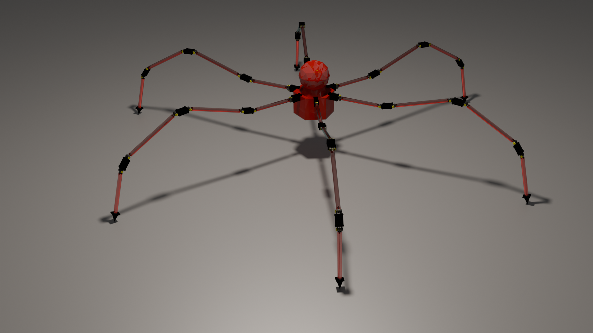

# Robotics & Sci-Fi 3D Models

A collection of 3D models designed and rendered in Blender, featuring robotic and sci-fi-inspired creations. This repository serves as a showcase of personal 3D modeling projects and is not intended for public use, modification, or distribution.

## Current Models
### 1. Hexaped Robot Model
- **Low-poly robotic design** with a mechanical aesthetic
- **Fully articulated legs** with multiple joints
- **Procedural materials and lighting setup** included

#### Preview

## Description
This repository contains original 3D models created for personal projects and experimentation in Blender. These models are not intended for external use, redistribution, or modification.

## Future Additions
This repository will be updated with more robotic and sci-fi models as new projects are completed.

## Disclaimer
These models are for personal showcase purposes only. They are not available for download, reuse, or redistribution, but I'm open to offers to work alongside.

## Contact
For inquiries or discussion about the models, feel free to reach out!

Created with ❤️ in Blender.
